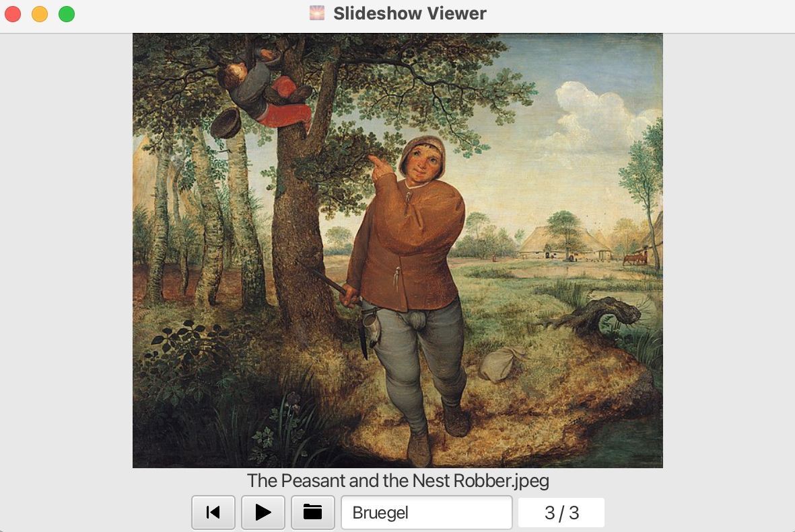

# Slider

Slider - Simple Slideshow Viewer implemented with JavaFX.
It allows to select a folder and form a slideshow using all JPEG images found in it (application starts with some preloaded artworks by Pieter Bruegel the Elder).
Pictures are sorted in alphabetical order.
Several simple controls were added:
- Play / pause button to run and stop the slideshow.
- Reset button to start the slideshow from the beginning. 
- Select folder button to select image folder.

<p align="center">
    
</p>

### Run with Maven

Requires Java 18, tested on Mac OS.

```bash
# Run tests
mvn test

# Run application
mvn javafx:run
```
